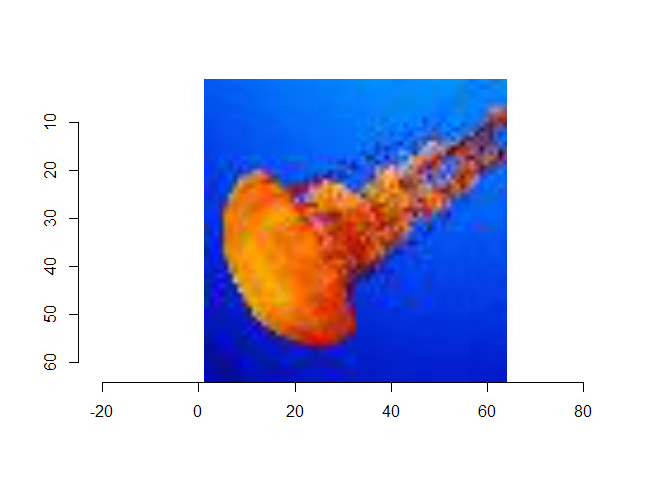

# project:meznet
frankiethull

*project:meznet* is a codename for the repo. Computer Vision image*net*s
are often stuck in a *mez*merized-self-hypnotic state of incorrectly
describing images or biased towards one answer or another. *Meznet* just
seemed like a cool word. Repo includes ensembling of many pre-trained
Keras, Torch, & use of local LLMs as a substitute.

*Keras* is a Deep Learning library with a pre-trained computer vision
models. The main idea started as an ensembling approach of pre-trained
models using ranking, means, and weighted averaging of many imagenets to
create one final outcome. It seemed like a fast-and-easy way to combine
imagenets without retraining the top layer on another dataset.

*Vixtral* is a play on words and discussed at the bottom of the
examples. The example includes use of Mixtral, an LLM, for computer
*vi*sion. This showcases an additional way for determining which labels
are the ideal answer for a particular image. The idea here was that
there are so many ways to ensemble the imagenets. There are also tons of
ways to fine-tune imagenets, but that’s a lot of effort. What if an LLM
can assist with image labeling?

setup:

``` r
library(dplyr)
library(tidyr)
library(purrr)
library(keras)
library(ggplot2)
library(gt)
library(fuzzyjoin)
library(reticulate)
options(scipen = 999)
```

#### pre-trained applications for keras

scrape keras pretrained application info:

``` r
# note, image size is not displayed on these tbls
tbl <- rvest::read_html("https://keras.io/api/applications/") |>
       rvest::html_table()

# smaller models
tbl[[1]] |> 
  arrange(`Size (MB)`) |>
  head(3)
```

    # A tibble: 3 × 8
      Model        `Size (MB)` `Top-1 Accuracy` `Top-5 Accuracy` Parameters Depth
      <chr>              <dbl> <chr>            <chr>            <chr>      <chr>
    1 MobileNetV2           14 71.3%            90.1%            3.5M       105  
    2 MobileNet             16 70.4%            89.5%            4.3M       55   
    3 NASNetMobile          23 74.4%            91.9%            5.3M       389  
    # ℹ 2 more variables: `Time (ms) per inference step (CPU)` <chr>,
    #   `Time (ms) per inference step (GPU)` <chr>

``` r
# top performing below size threshold
tbl[[1]] |>
  filter(`Size (MB)` < 100) |>  
  arrange(desc(`Top-5 Accuracy`)) |>
  head(10)
```

    # A tibble: 10 × 8
       Model          `Size (MB)` `Top-1 Accuracy` `Top-5 Accuracy` Parameters Depth
       <chr>                <dbl> <chr>            <chr>            <chr>      <chr>
     1 EfficientNetV…          88 83.9%            96.7%            21.6M      -    
     2 EfficientNetB4          75 82.9%            96.4%            19.5M      258  
     3 EfficientNetV…          59 82.0%            95.8%            14.5M      -    
     4 EfficientNetB3          48 81.6%            95.7%            12.3M      210  
     5 EfficientNetV…          42 80.5%            95.1%            10.2M      -    
     6 EfficientNetV…          34 79.8%            95.0%            8.2M       -    
     7 EfficientNetB2          36 80.1%            94.9%            9.2M       186  
     8 Xception                88 79.0%            94.5%            22.9M      81   
     9 EfficientNetB1          31 79.1%            94.4%            7.9M       186  
    10 EfficientNetV…          29 78.7%            94.3%            7.2M       -    
    # ℹ 2 more variables: `Time (ms) per inference step (CPU)` <chr>,
    #   `Time (ms) per inference step (GPU)` <chr>

load some computer vision models:

``` r
vision_models <- list(resnet50 = keras::application_resnet50(weights = "imagenet"),
                      mobilev2 = keras::application_mobilenet_v2(weights = "imagenet"),
                      efficib0 = keras::application_efficientnet_b0(weights = "imagenet"),
                      dense121 = keras::application_densenet121(weights = "imagenet"),
                      nasmobil = keras::application_nasnetmobile(weights = "imagenet")
                     )

model_ids <- data.frame(
  model_name = names(vision_models),
  id = 1:length(vision_models),
  stringsAsFactors = FALSE
)                      

# for post modeling validation layer:
wordnet_id <- data.table::fread("val_annotations.txt",
                                drop = 3:6,
                                col.names = c("image_name", "wnids"))

words      <- data.table::fread("words.txt", 
                                header = FALSE, 
                                col.names = c("wnids", "words"))

images <- list.files("images")

# wordnet for each image
validation_tbl <- wordnet_id |> 
                  filter(image_name %in% images) |> 
                  left_join(words)
```

    Joining with `by = join_by(wnids)`

image to processing and predictions:

``` r
img_processing <- function(image){
 img <- image
  # load / sizing 
img_path <- paste0("images/", img)
img <- image_load(img_path, target_size = c(224,224))
x <- image_to_array(img)

# 4d tensor
x <- array_reshape(x, c(1, dim(x)))
x <- imagenet_preprocess_input(x)
 return(x)
}

processed_images <- map(images, img_processing)

# make predictions then decode and print them
# map(vision_models, predict, processed_images[[1]])
# results <- map2(rep(vision_models, each = 4), processed_images, function(model, dataset) {
#      model$predict(dataset)
# })
# decoded_preds_list <- map(results, imagenet_decode_predictions, top = 20)

all_vision_df <- data.frame()
for(i in 1:length(images)){
    processed_img <- processed_images[[i]]  
    preds <- map(vision_models, predict, processed_img)
    
    decoded_preds_list <- map(preds, imagenet_decode_predictions, top = 1000)
    
    vision_df <- bind_rows(decoded_preds_list, .id = "id") |>
              mutate(
                id = as.numeric(id),
                image_name = images[[i]]
              )
    
    all_vision_df <- all_vision_df |>
                      bind_rows(vision_df)
}

all_vision_df <- all_vision_df |>
                  left_join(model_ids, by = "id")
```

post model validation, scoring each vision model for final stacked
ensemble:

``` r
# here we need the correct word (true label), 
# predictions for label, for each model 
# then solve for proper weights of each model, 
# to minimize label error

# we are going to built this weighted model stack
# based on inverse error using a lasso regression
validation_tbl
```

           image_name     wnids
     1:    val_5.JPEG n04399382
     2:   val_63.JPEG n03355925
     3:  val_108.JPEG n02124075
     4:  val_229.JPEG n04285008
     5:  val_242.JPEG n02099601
     6:  val_384.JPEG n01910747
     7:  val_899.JPEG n04285008
     8: val_1110.JPEG n07753592
     9: val_1536.JPEG n02793495
    10: val_4862.JPEG n04008634
    11: val_4985.JPEG n04487081
    12: val_5359.JPEG n02415577
    13: val_7609.JPEG n03085013
    14: val_7624.JPEG n04133789
    15: val_7736.JPEG n03854065
    16: val_8193.JPEG n04311004
    17: val_9426.JPEG n01644900
    18: val_9432.JPEG n02206856
    19: val_9464.JPEG n07734744
    20: val_9579.JPEG n07920052
                                                                                                  words
     1:                                                                               teddy, teddy bear
     2:                                                                             flagpole, flagstaff
     3:                                                                                    Egyptian cat
     4:                                                                           sports car, sport car
     5:                                                                                golden retriever
     6:                                                                                       jellyfish
     7:                                                                           sports car, sport car
     8:                                                                                          banana
     9:                                                                                            barn
    10:                                                                             projectile, missile
    11:                                                    trolleybus, trolley coach, trackless trolley
    12: bighorn, bighorn sheep, cimarron, Rocky Mountain bighorn, Rocky Mountain sheep, Ovis canadensis
    13:                                                                       computer keyboard, keypad
    14:                                                                                          sandal
    15:                                                                               organ, pipe organ
    16:                                                                               steel arch bridge
    17:                                 tailed frog, bell toad, ribbed toad, tailed toad, Ascaphus trui
    18:                                                                                             bee
    19:                                                                                        mushroom
    20:                                                                                        espresso

``` r
# wide_vis <- 
# all_vision_df |>
#     select(-class_name) |>
#     pivot_wider(names_from = class_description, 
#                 values_from = score, 
#                 values_fn = mean)

# top 5,10,etc. ranking:
# all_vision_df |> 
#   group_by(model_name, image_name) |>
#   arrange(desc(score)) |>
#   slice(1:5)

# dense121: ,,i SeE a WeBsItE''
# top-10 validation loop ################################################
word_matches <- data.frame()
for(k in 1:length(images)){
  
  image_words <- validation_tbl |> 
                filter(image_name == images[k]) |> 
                select(words) |> 
                pull() |>
                strsplit(", ") |>
                unlist()
  
    top_predicted_words <- all_vision_df |>
                            filter(image_name == images[k]) |>
                            group_by(model_name, image_name) |>
                            arrange(desc(score)) |>
                            slice(1:10) |>
                            mutate(
                              class_description = gsub("_"," ", class_description)
                            )
# we are going to change this to a fuzzyjoin    
# word_matching <- top_predicted_words |>
#                   filter(class_description %in% image_words)

img_word_df <- data.frame(true_description = image_words, 
                 stringsAsFactors = FALSE)

word_matching <- top_predicted_words |>
                    stringdist_right_join(img_word_df,
                                          by = c("class_description" = "true_description"),
                                          max_dist = 3)
  
  word_matches <- word_matches |> bind_rows(word_matching)  
}

word_matches <- word_matches |> na.omit()
```

# predictions for an image:

top scores for an image:

``` r
example_img <- "val_384.JPEG"

all_vision_df |>
  filter(image_name == example_img) |>
  arrange(desc(score)) |> 
  head()
```

      id class_name class_description      score   image_name model_name
    1  4  n03942813    ping-pong_ball 0.98930126 val_384.JPEG   dense121
    2  1  n01910747         jellyfish 0.58337778 val_384.JPEG   resnet50
    3  2  n03598930     jigsaw_puzzle 0.19837430 val_384.JPEG   mobilev2
    4  1  n01443537          goldfish 0.14303966 val_384.JPEG   resnet50
    5  1  n02606052       rock_beauty 0.12314548 val_384.JPEG   resnet50
    6  2  n03782006           monitor 0.05622787 val_384.JPEG   mobilev2

display image:

``` r
jpeg <- imager::load.image(paste0("images/", example_img))
plot(jpeg)
```



# ensembling

#### averaging predictions (soft-voting):

simple averaging across each model

``` r
all_vision_df |>
    filter(image_name == example_img) |>
    group_by(class_description) |>
    summarize(
        mean  = mean(score),
    ) |> 
  arrange(desc(mean)) |>
  head()
```

    # A tibble: 6 × 2
      class_description   mean
      <chr>              <dbl>
    1 ping-pong_ball    0.201 
    2 jellyfish         0.120 
    3 jigsaw_puzzle     0.0399
    4 goldfish          0.0290
    5 rock_beauty       0.0254
    6 monitor           0.0117

#### plural hard-voting:

taking the top votes via comparing the majority vote across the top
softmax scores

``` r
all_vision_df |>
    filter(image_name == example_img) |>
    group_by(model_name) |>
    arrange(desc(score)) |> 
    slice(1:10) |>
    ungroup() |>
    count(class_description) |>
    arrange(desc(n)) |>
  head()
```

    # A tibble: 6 × 2
      class_description     n
      <chr>             <int>
    1 digital_clock         2
    2 jellyfish             2
    3 parachute             2
    4 ping-pong_ball        2
    5 slot                  2
    6 spotlight             2

the models think this is either a clock, ping-pong ball, or jellyfish to
a human it’s pretty obvious it’s a jellyfish. This is why a validation
dataset is useful, determining which models perform best, and determine
weights for an ensemble. i.e. which model to trust for future
predictions.

#### weighted stack based on validation:

determine which models hit or miss then weight the predictions of each
model being ensembled. A super/meta learner could be a logistic lasso
category-2 model, optimize weights in an AUC loop, or weighted average
on accuracy.

all words that were captured by our models are below:

``` r
word_matches |> head()
```

      id class_name class_description      score    image_name model_name
    1  1  n02124075      Egyptian cat 0.04369976  val_108.JPEG   resnet50
    2  1  n07753592            banana 0.15416370 val_1110.JPEG   resnet50
    3  2  n03495258              harp 0.03496113 val_1536.JPEG   mobilev2
    4  1  n02793495              barn 0.54796726 val_1536.JPEG   resnet50
    5  1  n02814860            beacon 0.03419600 val_1536.JPEG   resnet50
    6  1  n04285008        sports car 0.05999950  val_229.JPEG   resnet50
      true_description
    1     Egyptian cat
    2           banana
    3             barn
    4             barn
    5             barn
    6       sports car

which models had a correct label in the top10 softmax predictions:

``` r
word_matches |> 
  group_by(model_name) |> 
  count()
```

    # A tibble: 5 × 2
    # Groups:   model_name [5]
      model_name     n
      <chr>      <int>
    1 dense121       1
    2 efficib0       3
    3 mobilev2       3
    4 nasmobil       1
    5 resnet50      20

weights based on accuracy

``` r
model_weights <- word_matches |> 
  group_by(model_name) |> 
  count() |>
  mutate(
    wgt = n / nrow(word_matches)
  )
```

#### weighted averaging predictions (weighted soft-voting):

weighted averaging across each model

``` r
all_vision_df |>
    filter(image_name == example_img) |>
    group_by(class_description) |>
  left_join(model_weights, by = c('model_name')) |>
  mutate(
    weighted_score = score * wgt
  ) |>
    summarize(
        mean  = mean(weighted_score),
    ) |> 
  arrange(desc(mean)) |>
  head()
```

    # A tibble: 6 × 2
      class_description    mean
      <chr>               <dbl>
    1 jellyfish         0.0837 
    2 goldfish          0.0205 
    3 rock_beauty       0.0177 
    4 ping-pong_ball    0.00770
    5 electric_ray      0.00483
    6 jigsaw_puzzle     0.00428

### throw it all together:

new image and scoring by model:

``` r
test_img_processing <- function(image){
 img <- image
  # load / sizing 
img_path <- paste0("test_images/", img)
img <- image_load(img_path, target_size = c(224,224))
x <- image_to_array(img)

# 4d tensor
x <- array_reshape(x, c(1, dim(x)))
x <- imagenet_preprocess_input(x)
 return(x)
}
# image processing
brand_new_img <- "val_7671.jpeg"
processed_new_img <- test_img_processing(brand_new_img)
results <- map(vision_models, predict, processed_new_img)
```

    1/1 - 0s - 193ms/epoch - 193ms/step
    1/1 - 0s - 76ms/epoch - 76ms/step
    1/1 - 0s - 116ms/epoch - 116ms/step
    1/1 - 0s - 181ms/epoch - 181ms/step
    1/1 - 0s - 94ms/epoch - 94ms/step

``` r
decoded_preds_list <- map(results, imagenet_decode_predictions, top = 1000)

# results:
test_df <- bind_rows(decoded_preds_list, .id = "id") |> 
            mutate(id = as.numeric(id)) |> 
            left_join(model_ids, by = "id") |>
            left_join(model_weights, by = "model_name")

# average across 1000 labels,
simp_avg <- test_df |> 
            group_by(class_description) |> 
            summarize(mean = mean(score)) |>
            arrange(desc(mean)) |>
            head(5)

# votes amongst top 10 sftmx scores of each model,
votes <- test_df |>
         group_by(model_name) |>
         arrange(desc(score)) |> 
         slice(1:10) |>
         ungroup() |>
         count(class_description) |>
         arrange(desc(n)) 
         
# weighted based on our validation data an
wgt_avg <- test_df |>
            group_by(class_description) |> 
            mutate(
            weighted_score = score * wgt
          ) |>
            summarize(
                mean  = mean(weighted_score),
            ) |> 
          arrange(desc(mean)) |> 
          head(5)

gt <- wgt_avg |>
  gt() |> 
  tab_header(title = html("top labels via weighted ensemble", 
                          local_image(paste0("test_images/", brand_new_img))))

gt |> as_raw_html()
```

<div id="kllmobymia" style="padding-left:0px;padding-right:0px;padding-top:10px;padding-bottom:10px;overflow-x:auto;overflow-y:auto;width:auto;height:auto;">
  &#10;  <table class="gt_table" data-quarto-disable-processing="false" data-quarto-bootstrap="false" style="-webkit-font-smoothing: antialiased; -moz-osx-font-smoothing: grayscale; font-family: system-ui, 'Segoe UI', Roboto, Helvetica, Arial, sans-serif, 'Apple Color Emoji', 'Segoe UI Emoji', 'Segoe UI Symbol', 'Noto Color Emoji'; display: table; border-collapse: collapse; line-height: normal; margin-left: auto; margin-right: auto; color: #333333; font-size: 16px; font-weight: normal; font-style: normal; background-color: #FFFFFF; width: auto; border-top-style: solid; border-top-width: 2px; border-top-color: #A8A8A8; border-right-style: none; border-right-width: 2px; border-right-color: #D3D3D3; border-bottom-style: solid; border-bottom-width: 2px; border-bottom-color: #A8A8A8; border-left-style: none; border-left-width: 2px; border-left-color: #D3D3D3;" bgcolor="#FFFFFF">
  <thead style="border-style: none;">
    <tr class="gt_heading" style="border-style: none; background-color: #FFFFFF; text-align: center; border-bottom-color: #FFFFFF; border-left-style: none; border-left-width: 1px; border-left-color: #D3D3D3; border-right-style: none; border-right-width: 1px; border-right-color: #D3D3D3;" bgcolor="#FFFFFF" align="center">
      <td colspan="2" class="gt_heading gt_title gt_font_normal gt_bottom_border" style="border-style: none; color: #333333; font-size: 125%; padding-top: 4px; padding-bottom: 4px; padding-left: 5px; padding-right: 5px; background-color: #FFFFFF; text-align: center; border-left-style: none; border-left-width: 1px; border-left-color: #D3D3D3; border-right-style: none; border-right-width: 1px; border-right-color: #D3D3D3; border-bottom-style: solid; border-bottom-width: 2px; border-bottom-color: #D3D3D3; font-weight: normal;" bgcolor="#FFFFFF" align="center">top labels via weighted ensemble </td>
    </tr>
    &#10;    <tr class="gt_col_headings" style="border-style: none; border-top-style: solid; border-top-width: 2px; border-top-color: #D3D3D3; border-bottom-style: solid; border-bottom-width: 2px; border-bottom-color: #D3D3D3; border-left-style: none; border-left-width: 1px; border-left-color: #D3D3D3; border-right-style: none; border-right-width: 1px; border-right-color: #D3D3D3;">
      <th class="gt_col_heading gt_columns_bottom_border gt_left" rowspan="1" colspan="1" scope="col" id="class_description" style="border-style: none; color: #333333; background-color: #FFFFFF; font-size: 100%; font-weight: normal; text-transform: inherit; border-left-style: none; border-left-width: 1px; border-left-color: #D3D3D3; border-right-style: none; border-right-width: 1px; border-right-color: #D3D3D3; vertical-align: bottom; padding-top: 5px; padding-bottom: 6px; padding-left: 5px; padding-right: 5px; overflow-x: hidden; text-align: left;" bgcolor="#FFFFFF" valign="bottom" align="left">class_description</th>
      <th class="gt_col_heading gt_columns_bottom_border gt_right" rowspan="1" colspan="1" scope="col" id="mean" style="border-style: none; color: #333333; background-color: #FFFFFF; font-size: 100%; font-weight: normal; text-transform: inherit; border-left-style: none; border-left-width: 1px; border-left-color: #D3D3D3; border-right-style: none; border-right-width: 1px; border-right-color: #D3D3D3; vertical-align: bottom; padding-top: 5px; padding-bottom: 6px; padding-left: 5px; padding-right: 5px; overflow-x: hidden; text-align: right; font-variant-numeric: tabular-nums;" bgcolor="#FFFFFF" valign="bottom" align="right">mean</th>
    </tr>
  </thead>
  <tbody class="gt_table_body" style="border-style: none; border-top-style: solid; border-top-width: 2px; border-top-color: #D3D3D3; border-bottom-style: solid; border-bottom-width: 2px; border-bottom-color: #D3D3D3;">
    <tr style="border-style: none;"><td headers="class_description" class="gt_row gt_left" style="border-style: none; padding-top: 8px; padding-bottom: 8px; padding-left: 5px; padding-right: 5px; margin: 10px; border-top-style: solid; border-top-width: 1px; border-top-color: #D3D3D3; border-left-style: none; border-left-width: 1px; border-left-color: #D3D3D3; border-right-style: none; border-right-width: 1px; border-right-color: #D3D3D3; vertical-align: middle; overflow-x: hidden; text-align: left;" valign="middle" align="left">jellyfish</td>
<td headers="mean" class="gt_row gt_right" style="border-style: none; padding-top: 8px; padding-bottom: 8px; padding-left: 5px; padding-right: 5px; margin: 10px; border-top-style: solid; border-top-width: 1px; border-top-color: #D3D3D3; border-left-style: none; border-left-width: 1px; border-left-color: #D3D3D3; border-right-style: none; border-right-width: 1px; border-right-color: #D3D3D3; vertical-align: middle; overflow-x: hidden; text-align: right; font-variant-numeric: tabular-nums;" valign="middle" align="right">0.041856566</td></tr>
    <tr style="border-style: none;"><td headers="class_description" class="gt_row gt_left" style="border-style: none; padding-top: 8px; padding-bottom: 8px; padding-left: 5px; padding-right: 5px; margin: 10px; border-top-style: solid; border-top-width: 1px; border-top-color: #D3D3D3; border-left-style: none; border-left-width: 1px; border-left-color: #D3D3D3; border-right-style: none; border-right-width: 1px; border-right-color: #D3D3D3; vertical-align: middle; overflow-x: hidden; text-align: left;" valign="middle" align="left">flatworm</td>
<td headers="mean" class="gt_row gt_right" style="border-style: none; padding-top: 8px; padding-bottom: 8px; padding-left: 5px; padding-right: 5px; margin: 10px; border-top-style: solid; border-top-width: 1px; border-top-color: #D3D3D3; border-left-style: none; border-left-width: 1px; border-left-color: #D3D3D3; border-right-style: none; border-right-width: 1px; border-right-color: #D3D3D3; vertical-align: middle; overflow-x: hidden; text-align: right; font-variant-numeric: tabular-nums;" valign="middle" align="right">0.013089646</td></tr>
    <tr style="border-style: none;"><td headers="class_description" class="gt_row gt_left" style="border-style: none; padding-top: 8px; padding-bottom: 8px; padding-left: 5px; padding-right: 5px; margin: 10px; border-top-style: solid; border-top-width: 1px; border-top-color: #D3D3D3; border-left-style: none; border-left-width: 1px; border-left-color: #D3D3D3; border-right-style: none; border-right-width: 1px; border-right-color: #D3D3D3; vertical-align: middle; overflow-x: hidden; text-align: left;" valign="middle" align="left">maraca</td>
<td headers="mean" class="gt_row gt_right" style="border-style: none; padding-top: 8px; padding-bottom: 8px; padding-left: 5px; padding-right: 5px; margin: 10px; border-top-style: solid; border-top-width: 1px; border-top-color: #D3D3D3; border-left-style: none; border-left-width: 1px; border-left-color: #D3D3D3; border-right-style: none; border-right-width: 1px; border-right-color: #D3D3D3; vertical-align: middle; overflow-x: hidden; text-align: right; font-variant-numeric: tabular-nums;" valign="middle" align="right">0.011160358</td></tr>
    <tr style="border-style: none;"><td headers="class_description" class="gt_row gt_left" style="border-style: none; padding-top: 8px; padding-bottom: 8px; padding-left: 5px; padding-right: 5px; margin: 10px; border-top-style: solid; border-top-width: 1px; border-top-color: #D3D3D3; border-left-style: none; border-left-width: 1px; border-left-color: #D3D3D3; border-right-style: none; border-right-width: 1px; border-right-color: #D3D3D3; vertical-align: middle; overflow-x: hidden; text-align: left;" valign="middle" align="left">Band_Aid</td>
<td headers="mean" class="gt_row gt_right" style="border-style: none; padding-top: 8px; padding-bottom: 8px; padding-left: 5px; padding-right: 5px; margin: 10px; border-top-style: solid; border-top-width: 1px; border-top-color: #D3D3D3; border-left-style: none; border-left-width: 1px; border-left-color: #D3D3D3; border-right-style: none; border-right-width: 1px; border-right-color: #D3D3D3; vertical-align: middle; overflow-x: hidden; text-align: right; font-variant-numeric: tabular-nums;" valign="middle" align="right">0.010348371</td></tr>
    <tr style="border-style: none;"><td headers="class_description" class="gt_row gt_left" style="border-style: none; padding-top: 8px; padding-bottom: 8px; padding-left: 5px; padding-right: 5px; margin: 10px; border-top-style: solid; border-top-width: 1px; border-top-color: #D3D3D3; border-left-style: none; border-left-width: 1px; border-left-color: #D3D3D3; border-right-style: none; border-right-width: 1px; border-right-color: #D3D3D3; vertical-align: middle; overflow-x: hidden; text-align: left;" valign="middle" align="left">electric_ray</td>
<td headers="mean" class="gt_row gt_right" style="border-style: none; padding-top: 8px; padding-bottom: 8px; padding-left: 5px; padding-right: 5px; margin: 10px; border-top-style: solid; border-top-width: 1px; border-top-color: #D3D3D3; border-left-style: none; border-left-width: 1px; border-left-color: #D3D3D3; border-right-style: none; border-right-width: 1px; border-right-color: #D3D3D3; vertical-align: middle; overflow-x: hidden; text-align: right; font-variant-numeric: tabular-nums;" valign="middle" align="right">0.009340743</td></tr>
  </tbody>
  &#10;  
</table>
</div>

**NOTE: for validation, we should use a large, diverse, image set. In
this example we used about 20 images for the sake of speed and
explanation.**

### *Vixtral & Friends*

Vixtral is an idea of using LLMs instead for imagenets for computer
vision. The idea is simple, “do pre-trained LLMs have better performance
as an imagenet than imagenets?” Replacing a local computer vision model
with a local llm is easy to do. But at a cost of RAM, these models are
much larger as well.

Mistral has quite a few 8GB RAM options, orca-mini is a 4GB RAM
requirement, there are a lot of smaller models to explore too. New LLMs
release by the day, the current format are GGUF files. In addition, new
types of models are being released with specific fine-tuned purposes.
Small Language Models are a thing too. A model that was released a month
ago (Phi-2) is a small language model which could also be used for this
type of task. Images and labels happen to be part of most training sets.
Similar to fine-tuning, it is also possible to prune a LLM to create a
smaller computer vision option, comparable in size to a pre-trained
keras. Ollama, HuggingFace, gpt4all, all have various pre-trained LLMs
to download. Below is example code for gpt4all as it is currently
available on windows.

``` python
from gpt4all import GPT4All
import os
cwd = os.getcwd()
subfolder = "gguf\\mistral"
filename = "mistral-7b-instruct-v0.1.Q4_0.gguf"

# llm model location (gguf file)
llm_path = os.path.join(cwd, subfolder, filename)
llm_model = GPT4All(llm_path)

# separate image for testing the llm, 
imgname  = "llm_images\\elephant.jpg"
img_path = os.path.join(cwd, imgname)

# let's see what the small llm handles computer vision:
img_prompt = 'hello, can you describe the main object in the image provided? Here is the location: ' + img_path + ', please list your top words to describe this image'

with llm_model.chat_session():
  response = llm_model.generate(prompt=img_prompt,temp=0.4,n_batch=4)
  # print(llm_model.current_chat_session)
  print(response)
```

    The main object in the image is an elephant. Based on my analysis of the image, here are some of the top words that could be used to describe it: 
    - Elephant
    - Gray
    - Trunk
    - Tusks
    - Ears
    - Nose
    - Body
    - Legs
    - Spots
